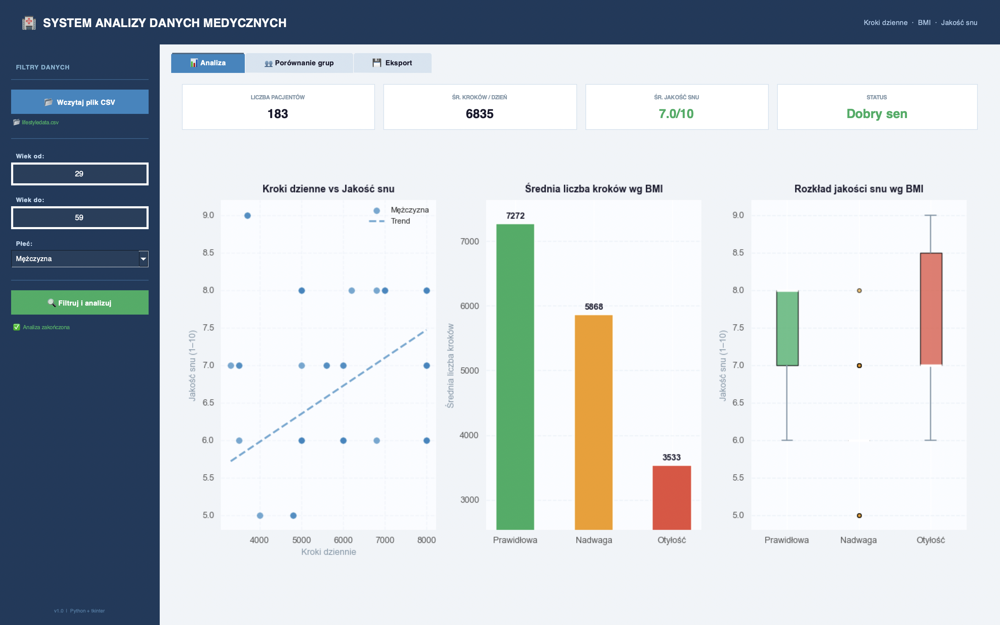
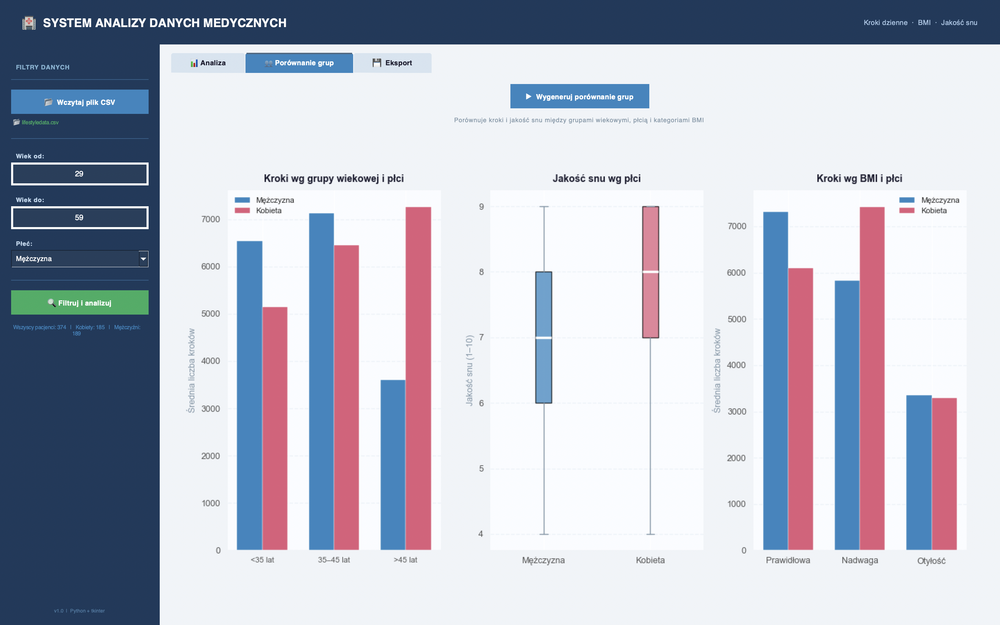
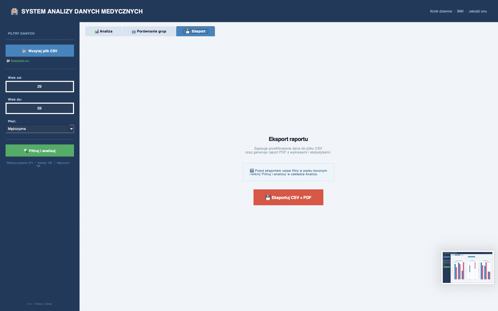

# 🏥 System Analizy Danych Medycznych

Aplikacja desktopowa napisana w Pythonie do analizy zależności między dzienną liczbą kroków, kategorią BMI oraz jakością snu pacjentów. Projekt zrealizowany w ramach zajęć z programowania w Pythonie.

---

## 📸 Podgląd aplikacji

<!--  -->

<!--  -->

<!--  -->
---

## 🔧 Technologie i biblioteki

| Biblioteka | Zastosowanie |
|---|---|
| `tkinter` | Interfejs graficzny (GUI) |
| `pandas` | Wczytywanie i przetwarzanie danych CSV |
| `matplotlib` | Generowanie wykresów |
| `numpy` | Obliczenia numeryczne (linia trendu) |
| `reportlab` | Generowanie raportów PDF |
| `platform` | Wykrywanie systemu operacyjnego (macOS/Windows) |

---

## ⚙️ Instalacja i uruchomienie

### 1. Sklonuj repozytorium
```bash
git clone hhttps://github.com/kurzepasylwia/AnalizaDanych-V2.git
cd AnalizaDanych-V2
```

### 2. Utwórz i aktywuj środowisko wirtualne
```bash
python3 -m venv .venv
source .venv/bin/activate        # macOS / Linux
.venv\Scripts\activate           # Windows
```

### 3. Zainstaluj wymagane biblioteki
```bash
pip install -r requirements.txt
```

### 4. Uruchom aplikację
```bash
python app-v2.py
```

---

## 📊 Funkcje aplikacji

### 🔷 Pasek boczny — filtry danych
- Wczytanie pliku CSV z danymi pacjentów
- Filtrowanie według **zakresu wieku** (pole "Wiek od" / "Wiek do")
- Filtrowanie według **płci** (Wszyscy / Male / Female)
- Przycisk **"Filtruj i analizuj"** uruchamiający analizę

### 📊 Zakładka: Analiza
- **4 karty statystyk** — liczba pacjentów, średnia kroków, średnia jakość snu, status (Dobry/Przeciętny/Zły sen)
- **Wykres rozrzutu** — zależność między krokami a jakością snu z linią trendu i podziałem na płeć
- **Wykres słupkowy** — średnia liczba kroków w podziale na kategorie BMI
- **Boxplot** — rozkład jakości snu według kategorii BMI

### 👥 Zakładka: Porównanie grup
- Kroki dzienne według grup wiekowych i płci
- Jakość snu według płci (boxplot)
- Kroki dzienne według BMI i płci

### 💾 Zakładka: Eksport
- Eksport przefiltrowanych danych do pliku **CSV**
- Generowanie raportu **PDF** ze statystykami i wykresami
- Oba pliki zapisywane jednocześnie po wyborze lokalizacji

---

## 📁 Dane

Dane pochodzą z publicznego zbioru dostępnego na platformie **Kaggle**:

> 📌 [Sleep Health and Lifestyle Dataset](https://www.kaggle.com/datasets/uom190346a/sleep-health-and-lifestyle-dataset)

Zbiór zawiera **374 rekordy** z informacjami o pacjentach:

| Kolumna | Opis | Użycie w aplikacji |
|---|---|---|
| `Age` | Wiek pacjenta | Filtr wiekowy |
| `Gender` | Płeć (Male/Female) | Filtr płci, wykresy |
| `Daily Steps` | Dzienna liczba kroków | Oś X, analiza główna |
| `BMI Category` | Kategoria BMI | Grupowanie, kolory |
| `Quality of Sleep` | Jakość snu (1–10) | Oś Y, statystyki |

---

## 📂 Struktura projektu

```
📁 projekt/
├── app-v2.py       # główny plik aplikacji
├── lifestyledata.csv     # dane do analizy (Kaggle)
├── requirements.txt      # lista wymaganych bibliotek
├── README.md             # dokumentacja projektu
└── assets/
    └── screenshot1.png   # zrzut ekranu aplikacji
```

---

## 👩‍💻 Autorka

Projekt zrealizowany w ramach zajęć z programowania w Pythonie - Sylwia Kurzępa.
